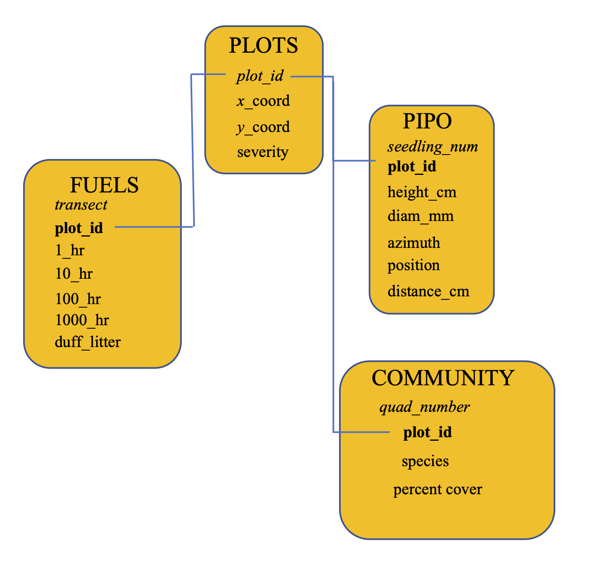

# Database Design and Structure

The PIPO project is organized as a relational database, or a collection of related tables. 
My project has four interrelated tables:

1. **PLOTS** : this table has all experimental plots, each with a unique *plot_id*.

2. **PIPO** : this table has data on ponderosa pine regeneration.

3. **FUELS** : this table has data on fuel loads in each plot, measured in different fuel classes.

4. **COMMUNITY** : this table contains all plant community data, measured as percent cover.




## Creating the Database Structure in R

RSQLite was used in R to create the database in SQL. Below is the code used to create the database structure.
To start, necessary packages were loaded and a connection for the database needs to be established.
```
# load packages ----
library(DBI)

# establish a connection with the database
PIPO_db <- dbConnect(RSQLite::SQLite(),
                        "/Users/nadav/Documents/USU/Thesis/MS/PIPO.db")
```

After connection was established, time to make the **Plots** table. For this, the
*plot_id* is the PRIMARY KEY, as it is a unique value for each plot.
```
# creating the 'plots' table
dbExecute(PIPO_db, "CREATE TABLE plots (
          plot_id varchar(15) NOT NULL,
          x_coord double,
          y_coord double,
          severity varchar(5),
          PRIMARY KEY (plot_id)
);")

```

Next is the **Fuels** table. For this, *transect* is the PRIMARY KEY.
```
# creating the 'fuels' table
dbExecute(PIPO_db, "CREATE TABLE fuels (
          transect varchar(15) NOT NULL,
          plot_id varchar(15),
          1_hr double,
          10_hr double,
          100_hr double,
          1000_hr double,
          duff_litter double,
          PRIMARY KEY (transect)
);")
```

Next, the **PIPO** table. For this, *seedling_num* is the PRIMARY KEY, which is a 
unique ID for each seedling measured.
```
# creating the 'PIPO' table
dbExecute(PIPO_db, "CREATE TABLE pipo (
          seedling_num double NOT NULL,
          plot_id varchar(15),
          height_cm double,
          diam_cm double,
          azimuth double,
          position double,
          distance_cm double,
          PRIMARY KEY (seedling_num)
);")
```

Finally, the **community** table. For this, *quad_number* is the PRIMARY KEY, which is a
unique ID for each plot monitored.
```
# creating the 'community' table
dbExecute(PIPO_db, "CREATE TABLE community (
          quad_number double NOT NULL,
          plot_id varchar(15),
          species varchar(10),
          percent_cover double,
          PRIMARY KEY (quad_number)
);")

```

