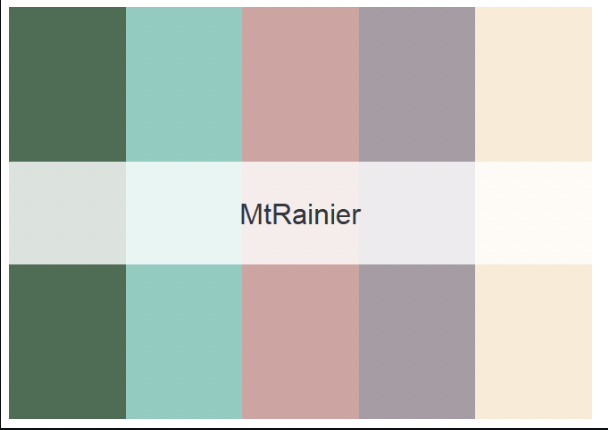
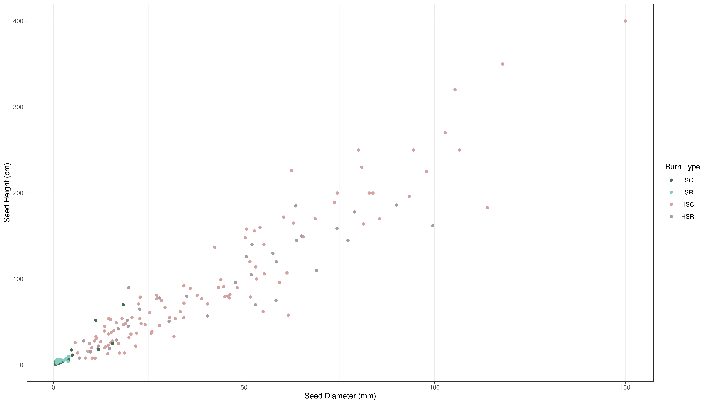
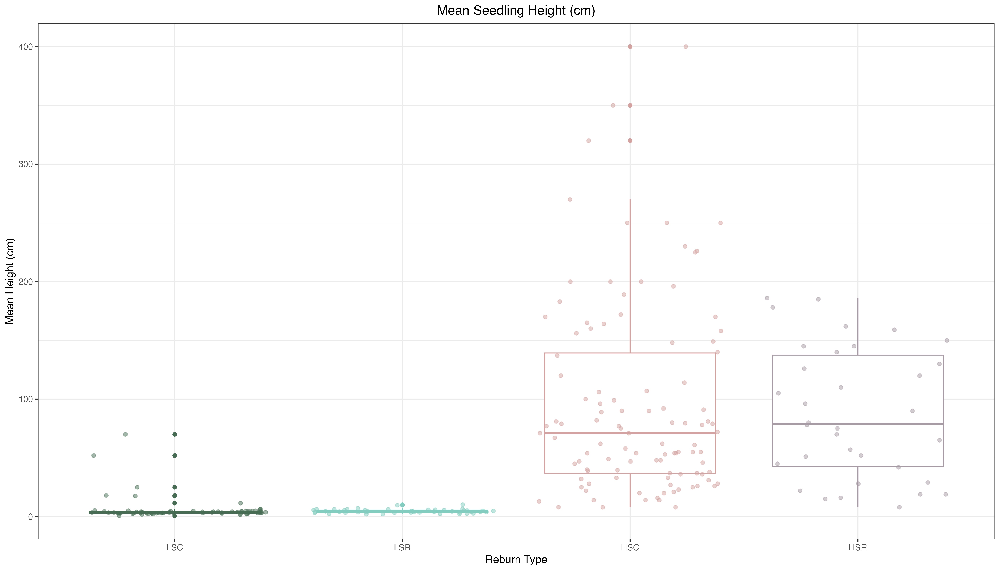
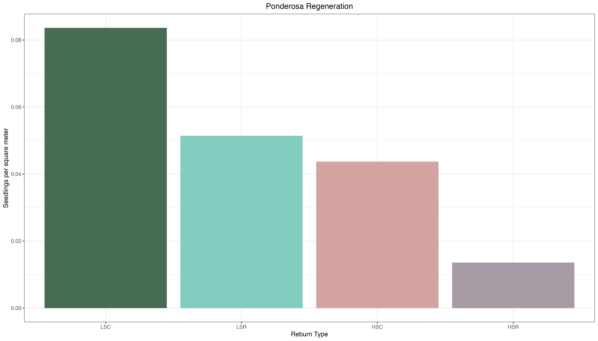
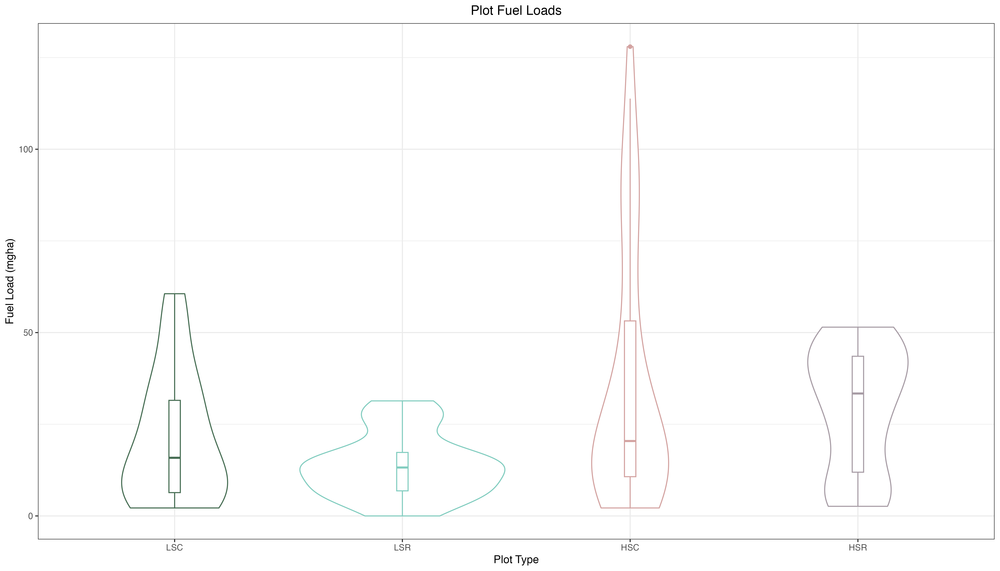
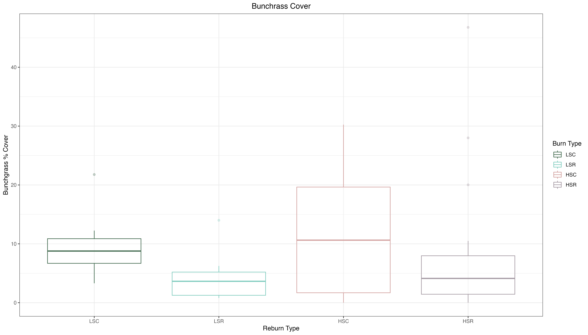
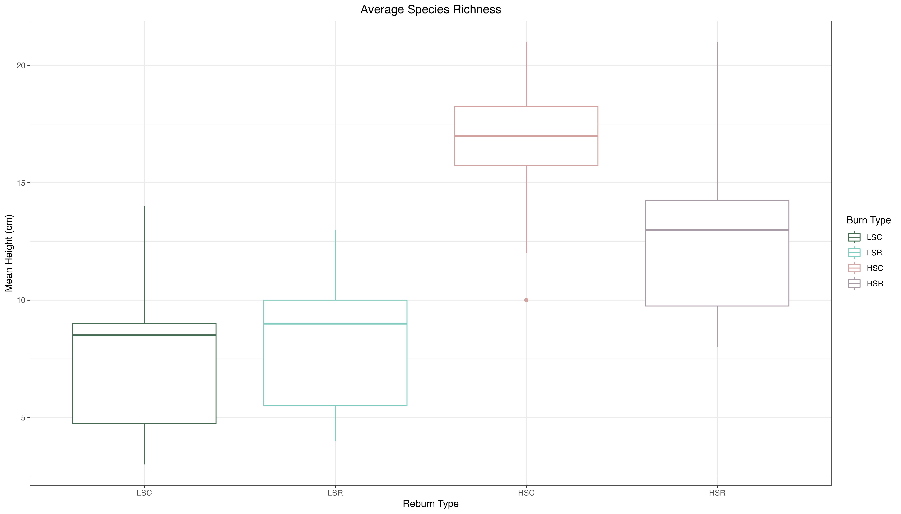

# Visualizing Data with ggplot2

In this chapter I will use ggplot2 to visualize  the pilot data
I collected last summer (2022) in a reburn fire  north of Flagstaff, AZ. 
I collected my data across different fire severities and reburn combinations. 
I set up plots in reburns of low and high severity patches, as well as areas that burned once at low
and high severity. The plot types are as follow:

1. Low severity control (**LSC**): burned once at low severity.
2. Low severity reburn (**LSR**): reburn of low severity patch.
3. High severity control (**HSC**): burned once at high severity.
4. High severity reburn (**HSR**): reburn of high severity patch.

Additionally, I will create a consistent color scheme where each plot type has the same color
across my figures using the National Park palette! 

There will be three plot subsections, each visualizing different types of data:

1. **Ponderosa Regeneration** : differences in ponderosa pine regeneration across plot types. 
2. **Fuel Load** : differences in fuel load across plots.
3. **Plant Community** : differences in plant community composition.


## Requisite Packages

The following packages were used in R for the plots:

```
library(tidyverse)
library(ggplot2)
library(dplyr)
library(reshape2)
library(nationalparkcolors)
```

The National Park Palette was downloaded from github and used to create a consistent color
scheme for all plots. The "Mt. Rainier" color palette was used:
```
pal <- park_palette("MtRainier", 4)
```

Here is what the Mt. Rainier palette looks like:


## Ponderosa Regeneration

Ponderosa regeneration is quantified as stems per hectare. Height (cm) and diameter at root collar (mm)
were measured for all ponderosa in plots.

For the first plot, I looked at the relationship between ponderosa height and diameter across my plots.
The code and the resulting plot are as follows:

```
PIPO_scatter <- regen2 %>%
  mutate(burn_type = factor(burn_type, levels = c("LSC", "LSR", "HSC", "HSR"))) %>%
ggplot(aes(x = seed_diam, y = seed_height, color = burn_type)) +
  geom_point() +
  labs(x = "Seed Diameter (mm)",
       y = "Seed Height (cm)",
       color = "Burn Type") +
  scale_color_manual(values=pal) +
  theme_bw()
```



The next plot examines the differences in ponderosa mean height across plot types.
The code and resulting plot are as follows:
```
seedheight_plot <- regen2 %>%
  mutate(burn_type = factor(burn_type, levels = c("LSC", "LSR", "HSC", "HSR"))) %>%
  ggplot(aes(x = burn_type, y = seed_height, color = burn_type)) +
  geom_boxplot() +
  geom_jitter(alpha = 0.5) +
  labs(x = "Reburn Type", y = "Mean Height (cm)", title = "Mean Seedling Height (cm)",
       color = "Burn Type") +
  theme_bw() +
  theme(legend.position = "none") +
  theme(plot.title = element_text(hjust = 0.5)) +
  scale_color_manual(values = pal)
```


The final plot is a bar plot that examines the differences in ponderosa regeneration 
(in stems per square meter) across plot types. The code and resulting plot are as follows:
```
seed_m2 <- sev_sum %>%
  mutate(burn_type = factor(burn_type, levels = c("LSC", "LSR", "HSC", "HSR"))) %>%
  ggplot(aes(x = burn_type, y = seed_per_m2, fill = burn_type)) +
  geom_col() +
  labs(x = "Reburn Type", y = "Seedlings per square meter", title = "Ponderosa Regeneration",
       fill = "Burn Type") +
  theme_bw() +
  theme(legend.position = "none") +
  theme(plot.title = element_text(hjust = 0.5)) +
  scale_fill_manual(values = pal)
```




## Fuel Load

This next section will be examining differences in fuel load across my plot types. Fuel loads
were meausured using Browns Transects and quantified in mgha, or metric tons per hectare.

The raw data was processed with the Rfuels package downloaded from github:
https://github.com/danfosterfire/Rfuels.git

The first plot is a violin plot with a boxplot overlay. Violin plots are useful because 
they show peaks in the data was well as the distribution of the data. The code and plot are as follows:
```
fuel_plot <- pumpkin_fuel_loads %>%
  mutate(plot_type = factor(plot_type, levels = c("LSC", "LSR", "HSC", "HSR"))) %>%
  ggplot(aes(x = plot_type, y = fuelload_total_Mgha, 
             color = plot_type)) +
  geom_violin() + 
  geom_boxplot(width = 0.05) +
  labs(x = "Plot Type", 
       y = "Fuel Load (mgha)",
       title = "Plot Fuel Loads",
       color = "Plot Type") +
  theme_bw() +
  theme(plot.title = element_text(hjust = 0.5)) +
  scale_color_manual(values=pal) +
  theme(legend.position = "none")
```


The second plot is a stacked bar plot, where each bar shows the amount of each fuel type.
The fuel types are: duff, litter, 1hr, 10hr, 100hr, 1000hr (rotten and sound). The data first had to be transformed from 
with the "pivot longer" function. The code and plot are as follows:
```
fuel_pivot <- pumpkin_fuel_loads %>%
  select(c(6:12,17)) %>%
  mutate(plot_type = factor(plot_type, levels = c("LSC", "LSR", "HSC", "HSR"))) %>%
  pivot_longer(cols = -plot_type, names_to = "fuel_load", values_to = "load_value") %>%
  ggplot(aes(x = plot_type, y = load_value, fill = fuel_load)) +
  geom_bar(position = "stack", stat = "identity") +
  theme_bw() +
  scale_fill_brewer(labels = c("1000 hour rotten",
                               "1000 hour sound",
                               "100 hour",
                               "10 hour",
                               "1 hour",
                               "Duff",
                               "Litter")) +
  labs(x = "Plot Type", y = "Fuel Load (mgha)", 
       title = "Plot Fuel Load", fill = "Fuel Class") +
  theme(plot.title = element_text(hjust = 0.5))
```


## Plant Community

This last sections examines trends in my plant community data. Plant cover of all species was estimated in each plot.
In the first plot, I am looking at average percent cover of native bunchgrasses, which are important agents of ecosystem
stability and health. The code and figure are as follows:
```
bunch_box1 <- bunch_anova %>%
  mutate(type = factor(type, levels = c("LSC", "LSR", "HSC", "HSR"))) %>%
  ggplot(aes(x = type, y = sum, color = type)) +
  geom_boxplot(alpha = 0.3) +
    labs(x = "Reburn Type", y = "Bunchgrass % Cover", title = "Bunchrass Cover",
         color = "Burn Type") +
    theme_bw() +
    theme(plot.title = element_text(hjust = 0.5)) +
  scale_color_manual(values = pal)
```


In the final plot I looked at the average species richness in plots. Species richness is the unique number 
of species present in each plot. The code and figure are as follows:
```
rich_box1 <- richness_aov %>%
  mutate(type = factor(type, levels = c("LSC", "LSR", "HSC", "HSR"))) %>%
  ggplot(aes(x = type, y = richness, color = type)) +
  geom_boxplot() +
  labs(x = "Reburn Type", y = "Mean Height (cm)", title = "Average Species Richness",
       color = "Burn Type") +
  theme_bw() + 
  theme(plot.title = element_text(hjust = 0.5)) +
  scale_color_manual(values = pal)
```
